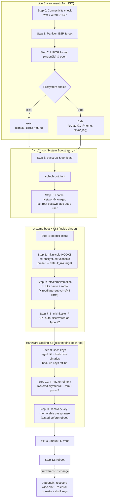

# Arch Linux: systemd-boot + LUKS2 + TPM2 + Secure Boot

A guide for setting up Arch Linux with full disk encryption, TPM2 auto-unlock,
and Secure Boot — using `systemd-boot` and Unified Kernel Images instead of
GRUB. This avoids GRUB's Argon2id/PBKDF2 compatibility questions and the
still-unmerged GRUB LUKS2 `systemd-tpm2` token bridge, since `systemd-boot`
never touches LUKS at all — disk decryption happens entirely in the
initramfs via `sd-encrypt`.

**Scope:** this guide covers the boot/encryption chain specifically — it is
not a full Arch installation walkthrough. It assumes you'll handle most of
the usual remaining install steps (locale, hostname) separately, per the
standard Arch installation guide. Network manager installation and basic
user setup are the two exceptions — see the notes in step 3, since
skipping either leaves you with a system you effectively can't use or
update after the first reboot.

**One networking gotcha worth knowing before you start:** unlike most of
the deferred post-install tasks, missing network config isn't just an
inconvenience — after the first reboot you'll have a `base` system with no
network manager installed at all, meaning you can't even run `pacman -Syu`
to catch up on anything else without first getting online. `linux-firmware`
(already in step 3's `pacstrap`) covers Wi-Fi firmware and the kernel's
`iwlwifi` driver will load, so the hardware itself will be detected — but
nothing will automatically connect. Step 3 below includes `networkmanager`
in `pacstrap` and enables it in the chroot for exactly this reason; if
you'd rather handle networking differently, that's the point in the guide
to change it.

---

## Architecture overview



This mirrors the numbered steps below — the diagram is an overview, not a
replacement for reading the actual commands in each section, particularly
around the filesystem branch in step 2 and the cmdline branch in step 6.

---

## 0. Connect to the internet (live ISO)

Everything from here through `pacstrap` needs network access from the
live environment itself — this is separate from `networkmanager`, which
gets installed onto the *new* system for use after reboot, not for the
install process.

If you're using a custom desktop-enabled ISO (e.g. one with XFCE and
NetworkManager already built in) rather than the stock Arch ISO, connect
via the desktop's network applet instead of `iwctl` below, then skip
straight to the pacman sync section.

**Wired:** usually just works via DHCP automatically. Confirm with:

```bash
ping -c3 archlinux.org
```

**Wi-Fi:** the live ISO ships `iwd` already, accessible via `iwctl`:

```bash
iwctl
```

Inside the `iwctl` prompt:

```
device list
station wlan0 scan
station wlan0 get-networks
station wlan0 connect "Your-SSID"
```

(substitute your actual device name if it's not `wlan0`, and your
network's SSID). Enter your Wi-Fi password when prompted, then exit:

```
exit
```

Confirm connectivity:

```bash
ping -c3 archlinux.org
```

### Sync the package database and mirrorlist

The live ISO's pacman database and mirrorlist are only as current as
whenever the ISO was built — for a custom ISO that's been sitting around
for a while, this is worth doing before `pacstrap` rather than
discovering a dead mirror partway through:

```bash
reflector --latest 10 --sort rate --save /etc/pacman.d/mirrorlist
pacman -Syy
```

`reflector` regenerates the mirrorlist with current, fast mirrors —
usually the actual fix when `pacstrap` hangs or fails partway through, not
just a sync against an already-dead mirror. `-Syy` (double-y) forces a
full re-download of the databases rather than trusting the ISO's possibly
stale local copy, which matters more the older the ISO is. If your ISO
is fresh (built in the last week or two), a plain `pacman -Sy` on its own
is probably enough, and `reflector` may not be strictly necessary — but
neither costs much to run regardless.

### Optional: SSH in from another machine

Once you're online, the rest of the install can be done over SSH from a
different computer rather than typing everything at the laptop's own
keyboard — genuinely worth it for a long, multi-step install like this
one, since copy-pasting commands from this guide is much easier on a full
keyboard/screen elsewhere than on the install target itself.

Set a root password on the live environment (this is separate from, and
unrelated to, the root password you'll set on the actual installed system
in step 3):

```bash
passwd
```

Start SSH on the live ISO — it's already installed, just not running by
default:

```bash
systemctl start sshd
```

Find this machine's IP address:

```bash
ip addr
```

Look for the address on your active interface (`wlan0` for Wi-Fi, or the
Ethernet interface name if wired) — typically something like
`192.168.x.x`.

From another machine on the same network:

```bash
ssh root@<the-IP-you-found>
```

Accept the host key prompt on first connection, enter the password you
just set, and you're in — everything from partitioning onward can now be
run from this SSH session instead of the laptop's own console. This is a
convenience for the live-ISO stage only; it has no bearing on the
installed system's own SSH configuration, which isn't covered by this
guide.

Don't proceed to partitioning until the network connectivity check above
succeeds — `pacstrap`, `genfstab`, and everything else through step 3
depends on it. The SSH step above is optional; skip straight to step 1 if
you'd rather work directly at the laptop's console.

## 1. Partitioning (during install)

- **EFI System Partition** — FAT32, ~1GiB, mounted at `/efi`
  (systemd-boot convention; not `/boot/efi`)
- **Root** — one LUKS2 partition, containing Btrfs or ext4

If you're dual-booting and already have an ESP from an existing Windows
or other Linux install, you don't need a fresh one — reuse it. Confirm
its partition type is `EFI System`
(`C12A7328-F81F-11D2-BA4B-00A0C93EC93B` in GPT, shown by tools like
`fdisk`/`gdisk` as type `ef00`), and mount the existing partition at
`/efi` rather than creating a new one. Arch's UKI and `systemd-boot`
files coexist fine alongside an existing OS's boot files on the same ESP
— nothing in this guide touches or removes what's already there.

### Creating a new layout

If you're reusing an existing ESP as above, skip the ESP-creation steps
below, but you still need to identify the disk and create the **root**
partition — continue reading, just stop before formatting anything as
FAT32.

Identify your target disk first — get this wrong and you'll partition
the wrong drive:

```bash
lsblk
```

Look for the disk by size and existing layout, not just by name — device
names (`/dev/sda`, `/dev/nvme0n1`) can shift between boots, especially
with multiple drives attached. The rest of this section uses
`/dev/sdX` as a placeholder; substitute your actual device (e.g.
`/dev/nvme0n1`, in which case partitions are `/dev/nvme0n1p1`,
`/dev/nvme0n1p2` rather than `/dev/sda1`, `/dev/sda2` — note the `p`
before the partition number on NVMe devices, easy to miss when
copy-pasting).

If you'd rather not track that `p`-or-no-`p` distinction by hand through
every command below, set variables once and use those instead:

```bash
DISK="/dev/nvme0n1"        # adjust to your actual device

if [[ "$DISK" == *nvme* ]]; then
  ESP="${DISK}p1"; ROOT="${DISK}p2"
else
  ESP="${DISK}1"; ROOT="${DISK}2"
fi
```

With that set, every `/dev/sdX1`/`/dev/sdX2` below becomes `$ESP`/`$ROOT`
— substitute as you prefer; the rest of this guide uses the literal
`/dev/sdX1`/`/dev/sdXY` form for readability.

**If this is a fresh disk with no existing partition table**, create a
new GPT table first — this is destructive, so double-check the device
name before running it. Skip this if you're adding a root partition to
a disk that already has a GPT table (e.g. the dual-boot case, where the
existing ESP's disk already has one):

```bash
parted /dev/sdX -- mklabel gpt
```

**Create the ESP** — 1GiB, with the `esp` flag (which also implies
`boot`, so no separate flag is needed). Sizing it at 1GiB rather than a
tighter 512MiB is deliberately generous: each UKI bundles the kernel,
initramfs, and microcode into one binary, and between a default +
fallback UKI and a second kernel if you ever add one (e.g. `linux-lts`),
a 512MiB ESP can genuinely run short of room at update time — 1GiB gives
enough headroom that you won't need to revisit this later. **If you're
reusing an existing ESP, skip this step and the format step below it**
— go straight to "Create the root partition":

```bash
parted /dev/sdX -- mkpart ESP fat32 1MiB 1025MiB
parted /dev/sdX -- set 1 esp on
```

**Create the root partition** in the remaining space — `100%` takes
whatever's left on the disk:

```bash
parted /dev/sdX -- mkpart cryptroot 1025MiB 100%
```

By default `parted` assigns this the generic `Linux filesystem` type
(GUID `0FC63DAF-8483-4772-8E79-3D69D8477DE4`, shown as `8300` in
`fdisk`/`gdisk`). There's also a dedicated `Linux LUKS` type
(`CA7D7CCB-63ED-4C53-861C-1742536059CC`, `8309`) that some tools use for
GPT auto-discovery of encrypted volumes — but this guide doesn't rely on
that mechanism (root is found via the explicit `rd.luks.name=`/`root=`
kernel parameters in step 6, not partition-type auto-detection), so the
plain `Linux filesystem` type from the command above is fine as-is. If
you'd rather set it explicitly anyway for clarity when inspecting the
disk later:

```bash
parted /dev/sdX -- type 2 CA7D7CCB-63ED-4C53-861C-1742536059CC
```

Confirm the result before continuing:

```bash
lsblk /dev/sdX
parted /dev/sdX -- print
```

You should see two partitions: the ESP (`/dev/sdX1`) and what will
become your LUKS container (`/dev/sdX2` — or, if you're reusing an
existing ESP, whatever number `parted` assigned the new root partition
on that disk). **Format the ESP now** — this is the one partition in
this layout formatted directly, since LUKS and the filesystem inside it
are handled together in the next step. **Skip this if you're reusing an
existing ESP** — it's already formatted, and reformatting it would wipe
whatever's already on it (including the other OS's boot files):

```bash
mkfs.fat -F32 /dev/sdX1
```

Don't format `/dev/sdX2` — leave it as a raw, unformatted partition.
`cryptsetup luksFormat` in step 2 writes the LUKS2 header directly onto
it; formatting it with a filesystem first would just get overwritten.

## 2. Encrypt and open the root partition

```bash
cryptsetup luksFormat --type luks2 --pbkdf argon2id \
  --pbkdf-memory 8388608 /dev/sdXY
cryptsetup open /dev/sdXY cryptroot
```

`/dev/sdXY` here is the root partition from step 1 (`/dev/sdX2` in the
example above) — the raw, unformatted one, not the ESP. `luksFormat`
writes the LUKS2 header onto it directly; there's no separate
"create a partition for LUKS" step beyond the plain partition already
created above, since LUKS doesn't need its own partition type or
pre-formatting to work — it operates directly on the block device.

`--pbkdf-memory 8388608` sets the Argon2id memory cost to 8GiB, well above
`cryptsetup`'s 1GiB default and RFC 9106's 2GiB "default for all
environments" recommendation. This is a deliberate choice here, not a
generally-recommended value — it makes sense specifically because this
machine has 40GB of RAM to spare and this drive isn't intended to move to
lower-RAM hardware. On a machine with less memory headroom, or a drive
that might get unlocked elsewhere, RFC 9106's 2GiB figure
(`--pbkdf-memory 2097152`) is the better-grounded default. Test the unlock
time once after formatting:

```bash
time cryptsetup open /dev/sdXY cryptroot
```

Argon2id works natively here — no PBKDF2 workaround needed, since nothing
in this chain touches GRUB. `--iter-time` is also tunable if you want to
adjust the time cost independently, though the memory cost above is doing
most of the real hardening work. Note that defaults and available flags
do shift between `cryptsetup` versions.

### Filesystem choice: ext4 or Btrfs

Both work fine with this boot chain — `sd-encrypt` and `systemd-boot`
don't care which one sits inside the LUKS volume. The tradeoff is between
simplicity and rollback capability, not compatibility.

**ext4** — simpler, zero maintenance, predictable free-space reporting.
Good default if you don't specifically want snapshots.

```bash
mkfs.ext4 /dev/mapper/cryptroot
mount /dev/mapper/cryptroot /mnt
mkdir -p /mnt/efi
mount /dev/sdXZ /mnt/efi   # your ESP partition
```

**Btrfs** — worth it mainly for snapshots: on a rolling-release distro
like Arch, being able to snapshot before `pacman -Syu` (or before
re-signing UKIs via `sbctl`) and roll back a broken update in seconds is a
genuine safety net this guide's threat model doesn't otherwise cover.
Trade-off is a bit more maintenance (periodic scrub/balance) and slightly
less predictable `df` output due to copy-on-write allocation. This guide
uses Btrfs without compression — `compress=zstd` is a reasonable addition
later if you want it, but it's a separate decision from the subvolume
layout below, so it's left out here to keep the filesystem setup and the
compression choice independent.

```bash
mkfs.btrfs /dev/mapper/cryptroot
mount /dev/mapper/cryptroot /mnt

btrfs subvolume create /mnt/@
btrfs subvolume create /mnt/@home
btrfs subvolume create /mnt/@var_log
btrfs subvolume create /mnt/@swap
umount /mnt

mount -o noatime,subvol=@ /dev/mapper/cryptroot /mnt
mkdir -p /mnt/{efi,home,var/log,swap}
mount -o noatime,subvol=@home /dev/mapper/cryptroot /mnt/home
mount -o noatime,subvol=@var_log /dev/mapper/cryptroot /mnt/var/log
mount -o noatime,subvol=@swap /dev/mapper/cryptroot /mnt/swap
mount /dev/sdXZ /mnt/efi   # your ESP partition
```

`@swap` is created here alongside the others regardless of whether you
actually end up using a swapfile — it costs nothing to have an empty
subvolume, and creating it now (as a proper sibling of `@`, while `/mnt`
is still mounted at the top level) avoids a more awkward remount dance
later if you try to create it after switching to `subvol=@`.

`@var_log` as its own subvolume means logs survive if you ever roll `@`
back to an earlier snapshot — otherwise a rollback would silently revert
your logs along with everything else, which defeats half the point of
having them. If you go this route, `snapper` (or a similar tool) for
managing the actual snapshot lifecycle is the natural next step, but it's
outside this guide's scope — the subvolume layout above just lays the
groundwork for it.

The rest of this guide assumes root is mounted at `/mnt` and the ESP at
`/mnt/efi` regardless of which filesystem you picked — the remaining steps
don't otherwise differ between ext4 and Btrfs.

### Swap: a swapfile instead of a separate partition

A swapfile inside your already-encrypted root is simpler than a separate
swap partition — it's encrypted automatically as part of the LUKS volume,
with no second `cryptsetup` entry and no extra unlock prompt, and no
disk space locked into a fixed-size partition ahead of time. This also
means you don't need a third partition on the disk at all — just the ESP
and one LUKS2 partition for everything else.

**ext4:**

```bash
fallocate -l 8G /mnt/swapfile
chmod 600 /mnt/swapfile
mkswap /mnt/swapfile
swapon /mnt/swapfile
```

**Btrfs** — the `@swap` subvolume was already created and mounted at
`/mnt/swap` in the block above (regardless of whether you use it — no
harm if it stays empty). `btrfs filesystem mkswapfile` handles the
copy-on-write exclusion, permissions, and preallocation in one step —
manually chaining `truncate`/`chattr +C`/`fallocate`/`chmod`/`mkswap` is
the older way and no longer necessary since btrfs-progs 6.1:

```bash
btrfs filesystem mkswapfile --size 8G /mnt/swap/swapfile
swapon /mnt/swap/swapfile
```

Adjust the `8G` size to whatever suits your RAM and whether you want
hibernation support (see below).

`genfstab` will pick up the swapfile automatically **only if it already
exists before you run `genfstab` in step 3**. If you create the swapfile
after that point instead, add the line to `/etc/fstab` by hand:

```
/swapfile none swap defaults 0 0
```

(adjust the path to `/swap/swapfile` if you used the Btrfs layout above).

**Hibernation:** if you want to hibernate, it has to go through the
swapfile, not `zram` — hibernating to zram swap isn't supported, even
with a backing device configured. A swapfile-based hibernate needs a
`resume=` kernel parameter pointing at the swapfile's physical offset,
which is genuinely more involved to set up correctly with a swapfile
than with a dedicated swap partition — outside this guide's scope. If
hibernation matters to you, it's worth deciding that before committing to
the swapfile approach, since a plain swap partition is the simpler path
for that specific use case.

A swapfile and `zram` aren't mutually exclusive — `zram`'s compressed
in-RAM swap is used first by default (**higher** priority number wins,
not lower), with the disk-backed swapfile as overflow if RAM pressure
exceeds what `zram` can absorb. Setup for `zram` is in step 3, since it's
installed via `pacstrap` and configured inside the chroot.

## 3. Install the base system as normal, then chroot in

```bash
pacstrap /mnt base base-devel linux linux-headers linux-firmware mkinitcpio \
  sbctl btrfs-progs efibootmgr dosfstools intel-ucode networkmanager sudo \
  zram-generator \
  mc nano vim htop wget iwd iotop-c less man-pages mandoc bc
```

`sudo` isn't part of `base` — it's included here because the `wheel`/
`visudo` step further down in this section needs it installed already.
Without it, `visudo` won't exist to run.

`base-devel` and `linux-headers` are worth adding even though this guide
doesn't itself compile anything: `base-devel` (compilers, `make`, and the
rest of the standard build toolchain) is required the moment you install
anything from the AUR, and `linux-headers` is required for any
out-of-tree kernel module (DKMS-based drivers, VirtualBox host modules,
etc.). Neither is needed for the boot chain itself, but going without
them tends to mean an extra `pacman -S` and possibly a reboot the first
time you actually need either — cheaper to include now.

The rest of that line is general-purpose tooling, not required by
the boot/encryption chain, but worth having from first boot rather than
needing network access (which won't exist yet if something's wrong) to
fetch later:

- `nano`, `vim`, `mc` — text editors and a file manager; `mc` in
  particular is handy for poking around a fresh system
- `htop`, `iotop-c` — process and disk I/O monitoring
- `less`, `man-pages`, `mandoc` — so `man` pages actually work; `base`
  alone doesn't include documentation
- `wget` — command-line downloads
- `iwd` — an alternative Wi-Fi backend to `wpa_supplicant`; `NetworkManager`
  can use either, and `iwd` also works standalone via `iwctl` if you ever
  need to debug connectivity without NetworkManager in the picture
- `bc` — basic command-line arithmetic, occasionally useful in scripts

`networkmanager` is included here on the assumption you're on Wi-Fi (as on
a laptop like the XPS) — drop it if you're wired and happy configuring
`systemd-networkd` yourself instead. Enable it once you're in the chroot,
further down in this step.

`efibootmgr` and `dosfstools` aren't strictly required by this chain, but
you'll want both available for troubleshooting boot entries and working
with the FAT-formatted ESP from a running system.

`btrfs-progs` is worth having in the initramfs — not for `fsck` (Btrfs
doesn't use a boot-time fsck pass; `fsck.btrfs` is intentionally a no-op,
since Btrfs does its consistency checking in-kernel at mount time), but
for `btrfs device scan` if you ever use a multi-device Btrfs array, and
for `btrfs check`/repair tools being available in an emergency initramfs
shell. (Skip this package if you formatted root as ext4 instead, where
`fsck` genuinely does matter and the `fsck` hook below is doing real work.)

Generate `/etc/fstab` **before** chrooting, so the ESP and any non-root
mounts are correctly wired up:

```bash
genfstab -U /mnt >> /mnt/etc/fstab
```

Root itself is located via the `rd.luks.name=` and `root=` kernel
parameters set in step 6, not via fstab — but the ESP mount and anything
else still needs a correct fstab entry, and skipping this step is a
common cause of a system dropping to an emergency shell on first boot.

Now chroot in:

```bash
arch-chroot /mnt
```

If you included `networkmanager` above, enable it now while you're
already here:

```bash
systemctl enable NetworkManager
```

### zram

`zram-generator` doesn't need a `systemctl enable` — it's a systemd
generator, meaning it creates the swap unit automatically at boot based
on a config file, rather than being a service you enable directly.
Create that config now:

```bash
cat > /etc/systemd/zram-generator.conf << 'EOF'
[zram0]
zram-size = min(ram / 2, 8192)
# 8192 here means 8192 MB (~8GiB) — bare numbers in this config are
# megabytes by definition, not bytes; this matches zram-generator's own
# documented default of min(ram / 2, 4096)
compression-algorithm = zstd
swap-priority = 100
fs-type = swap
EOF
```

`zram-size = min(ram / 2, 8192)` sizes the compressed swap device at half
your RAM, capped at 8GiB — reasonable defaults; adjust to taste. If you'd
rather not deal with the `min()` expression at all, a plain fixed size
works too — `zram-size = 8192` gives a flat 8GiB regardless of how much
RAM the machine has, no expression needed.
`swap-priority = 100` ensures `zram` is preferred over the disk-backed
swapfile from step 2, which should have a lower priority set in its
`fstab` entry (or none, which defaults lower) so `zram` gets used first
and the swapfile only kicks in as overflow. No further action needed here
— the generator picks this config up automatically on next boot.

### Root password and a sudo-capable user

The base install has no usable login yet — set the root password and
create a normal user while you're still in the chroot, rather than
discovering there's no way in after the first reboot:

```bash
passwd
```

That sets root's password (running `passwd` with no username, while
still root inside the chroot, targets root itself).

```bash
useradd -m -G wheel -s /bin/bash george
passwd george
```

Adjust the username as you like. `-m` creates a home directory, `-G wheel`
adds the user to the `wheel` group, `-s /bin/bash` sets the shell.

Being in `wheel` isn't enough on its own — Arch ships `sudo` but doesn't
enable the `wheel` group for it by default. Edit the sudoers file with
`visudo`, never a direct text editor, since it validates syntax before
saving and a broken sudoers file can lock you out of `sudo` entirely:

```bash
EDITOR=nano visudo
```

Find and uncomment this line:

```
%wheel ALL=(ALL:ALL) ALL
```

Save and exit. Your user can now `sudo` after the next login.

## 4. Install and enable systemd-boot

```bash
bootctl install
```

This installs directly to the ESP — no `grub-mkconfig`, no `grub.cfg`
scripting.

**Ongoing maintenance, worth knowing now even though it's a later
concern:** `bootctl install` is a one-time setup command — it doesn't
keep the ESP's copy of systemd-boot in sync with future `systemd` package
upgrades. That's `bootctl update`'s job, and left to its defaults it
won't run automatically — not because systemd lacks the mechanism, but
because of Arch's package-management philosophy specifically. systemd
ships a stock unit for exactly this, `systemd-boot-update.service`
(`ExecStart=bootctl --variables=no --graceful update`, `WantedBy=sysinit.target`,
meaning it'd run at every boot and no-op harmlessly when there's nothing
to update) — but Arch, unlike some distros, never auto-enables services
on package install, so it sits there disabled until you turn it on
yourself:

```bash
systemctl enable systemd-boot-update.service
```

This matters because of the `sbctl` signing hook set up in step 9: it
re-signs whatever binary is currently sitting in the ESP, but without
this service enabled, that binary never actually gets updated — `sbctl`
would just keep faithfully re-signing an increasingly outdated
systemd-boot rather than picking up new releases as `systemd` itself is
upgraded.

## 5. Build a Unified Kernel Image (UKI)

Arch's `mkinitcpio` can output UKIs natively, but the two config files
involved do different jobs: `/etc/mkinitcpio.conf` sets which **hooks**
run, while `/etc/mkinitcpio.d/linux.preset` sets the **output target** —
including whether a UKI gets built at all.

In `/etc/mkinitcpio.conf`, use the `sd-encrypt` hook (not the legacy
`encrypt` hook). `sd-vconsole` and `keyboard` do different jobs and are
both worth keeping: `sd-vconsole` sets the console keymap/font,
`keyboard` ensures keyboard driver modules are actually loaded into the
initramfs — the latter matters most for USB keyboards, which need their
controller driver available before you can type a LUKS passphrase at an
early boot prompt. No real cost to including both:

```
HOOKS=(base systemd autodetect microcode modconf kms keyboard sd-vconsole block sd-encrypt filesystems fsck)
```

If your root is Btrfs, the `fsck` hook here is harmless but does nothing —
Btrfs has no boot-time fsck pass, so this hook is only doing real work on
ext4. Feel free to drop it from `HOOKS` on a pure-Btrfs setup; leaving it
in costs nothing either way.

`sd-vconsole` reads `/etc/vconsole.conf` for your keymap and console font.
If you're on a non-US keyboard layout, set this now — otherwise your LUKS
passphrase prompt (and everything else pre-userspace) will default to a US
layout:

```bash
echo "KEYMAP=uk" > /etc/vconsole.conf   # adjust to your layout
```

Then edit your kernel's preset file to point output at a UKI on the ESP
instead of a standard `.img`. The filename matches your kernel package —
`linux.preset` for the standard kernel, `linux-lts.preset` for LTS, and so
on. Check what you actually have:

```bash
ls /etc/mkinitcpio.d/
```

Then edit the relevant preset (`/etc/mkinitcpio.d/linux.preset` in the
standard case) with a text editor, e.g.:

```bash
nano /etc/mkinitcpio.d/linux.preset
```

You're looking for two existing lines and replacing each with a `_uki`
equivalent — nothing here needs to be invented, just found and edited.

**Before** (what's already in the file):
```sh
default_image="/boot/initramfs-linux.img"
fallback_image="/boot/initramfs-linux-fallback.img"
```

**After** (comment out the old lines, add the new ones directly below):
```sh
# default_image="/boot/initramfs-linux.img"
default_uki="/efi/EFI/Linux/arch-linux.efi"

# fallback_image="/boot/initramfs-linux-fallback.img"
fallback_uki="/efi/EFI/Linux/arch-linux-fallback.efi"
```

If your preset has no `fallback_image` line at all, skip the fallback
half — not every install uses one.

**Confirm the old `_image` lines are actually commented out, not just
edited nearby them.** If a `default_image`/`fallback_image` line is
left active alongside the new `_uki` line, `mkinitcpio` builds *both*
targets rather than one replacing the other — not something that breaks
boot, but it silently doubles your build time and wastes ESP space on
images you're not using. Check after editing:

```bash
grep -E '^(default|fallback)_image=' /etc/mkinitcpio.d/linux.preset
```

No output means both are correctly commented out. If either line
appears, go back and comment it out.

**Check for a `fallback_options="-S autodetect"` line elsewhere in the
same file, and don't remove it if present** — Arch's auto-generated
presets ship with this by default, and it's easy to overlook since it
sits apart from the two lines you're editing above. It matters more
than it looks: `-S autodetect` tells `mkinitcpio` to skip the
`autodetect` hook specifically for the fallback build, so the fallback
UKI carries a broad, untrimmed set of drivers rather than the
this-machine-only set `autodetect` produces for the default UKI. Without
it, your "fallback" is really just a second copy of the same image —
no more use than the default if the reason you needed a fallback was a
driver `autodetect` guessed wrong about. If your preset genuinely
doesn't have this line (unusual, but possible on a heavily hand-edited
config), add it back in on its own line near the other `fallback_*`
entries.

`mkinitcpio` will not create the destination directory for you — if
`/efi/EFI/Linux/` doesn't exist yet, UKI generation fails silently. Create
it before your first build:

```bash
mkdir -p /efi/EFI/Linux
```

### CPU microcode

With a traditional (non-UKI) setup, microcode used to be loaded via a
separate `initrd` image the bootloader concatenated in ahead of the main
one. That method is deprecated — current `mkinitcpio` (v38+) handles this
through the `microcode` hook already present in the `HOOKS` line above,
which bundles the microcode directly into the generated image (the
unified `.efi` binary, in this UKI setup) at build time. The package
being installed (`amd-ucode` or `intel-ucode`, per step 3) is what
actually supplies the microcode data; the hook is what pulls it in.

**Placement of `microcode` relative to `autodetect` changes what gets
included, not just when:** `autodetect` trims the initramfs down to only
what this specific machine needs — modules, and, if it precedes
`microcode`, only the current CPU's vendor microcode rather than every
vendor's. This guide places `microcode` *after* `autodetect` (as shown
above) deliberately, since you're building this UKI for one specific,
fixed machine, not a portable or rescue image that might run on
different hardware — there's no benefit to carrying both AMD and Intel
microcode blobs when only one will ever be used here.

If you ever do want the broader set (multi-hardware use, or you're
adapting this guide's `HOOKS` for a rescue/live image rather than a
fixed install), move `microcode` ahead of `autodetect` instead, or drop
`autodetect` entirely. You can confirm which vendor's microcode actually
made it into the built image with:

```bash
lsinitcpio --early /efi/EFI/Linux/arch-linux.efi | grep microcode
```

## 6. Kernel command line for sd-encrypt

Create `/etc/kernel/cmdline`. **This differs depending on which filesystem
you picked in step 2** — if you're on Btrfs with the subvolume layout
above, the kernel needs to be told which subvolume is root, or it'll mount
the top-level volume (which contains nothing but the `@`/`@home`/
`@var_log` directories) instead of your actual system, landing you in an
emergency shell.

**ext4:**
```
rd.luks.name=<LUKS-UUID>=cryptroot root=/dev/mapper/cryptroot rw
```

**Btrfs (with the `@` subvolume layout above):**
```
rd.luks.name=<LUKS-UUID>=cryptroot root=/dev/mapper/cryptroot rw rootflags=subvol=@
```

Use whichever line matches your step 2 choice — don't use the Btrfs line
on an ext4 install. An unrecognised mount option isn't reliably ignored by
every filesystem driver; treat the two as genuinely different commands
rather than one that happens to work for both.

Replace `<LUKS-UUID>` with the output of:

```bash
blkid -s UUID -o value /dev/sdXY
```

`mkinitcpio` reads `/etc/kernel/cmdline` when building a UKI and embeds it
into the `.efi` binary — that embedding is what makes the command line
tamper-evident under Secure Boot, since altering it breaks the signature.
If your preset overrides this with its own `CMDLINE=` or similar, that
takes precedence, so check the preset if the parameters don't appear to
take effect. If you run multiple kernels (e.g. `linux` and `linux-lts`),
each has its own preset and each needs its UKI target configured.

Neither cmdline example above includes a `resume=` parameter — that's
deliberate, not an oversight. Hibernation needs one, pointing at the
swapfile's physical offset, but setting that up correctly is outside this
guide's scope (see the hibernation note in step 2). If you want
hibernation, work that out before your first reboot, since it changes
this file.

## 7. Rebuild the UKI

```bash
mkinitcpio -P
```

## 8. Boot entry auto-discovery

Unlike GRUB2-BLS or manually-placed `.conf` entries, a UKI placed directly
in `/efi/EFI/Linux/` is auto-discovered by `systemd-boot` as a **Type #2**
entry — no manual boot entry file is needed.

Just confirm `/efi/loader/loader.conf` exists:

```bash
cat /efi/loader/loader.conf
```

A minimal version is fine:

```
default @saved
timeout 3
console-mode max
```

`systemd-boot` will populate the boot menu dynamically from
`/efi/EFI/Linux/*.efi`.

## 9. Secure Boot — enrol your own keys

Arch has no vendor shim in Microsoft's trust chain (unlike Fedora), so this
step is mandatory, not optional, if you want Secure Boot at all.

`sbctl` is the tool used throughout this guide, but worth knowing it's not
the only path: `bootctl` itself gained native key enrolment
(`--secure-boot-auto-enroll=yes`, with `--certificate=`/`--private-key=`)
in systemd 257, which populates the ESP's PK/KEK/db databases directly at
install time without a separate tool. This guide sticks with `sbctl`
throughout since it's more thoroughly exercised elsewhere in these steps
(status checks, signing, key backup) — not a suggestion to switch
mid-guide, just worth knowing the alternative exists if you're building
your own setup from scratch later.

```bash
sbctl status          # confirm you're in Setup Mode
sbctl create-keys
sbctl enroll-keys -m  # -m includes Microsoft's certs — useful for dual-boot
                       # and firmware update compatibility
sbctl sign -s /efi/EFI/Linux/arch-linux.efi
sbctl sign -s -o /usr/lib/systemd/boot/efi/systemd-bootx64.efi.signed \
  /usr/lib/systemd/boot/efi/systemd-bootx64.efi
bootctl update
sbctl verify
```

The `-m` flag isn't just for dual-boot — some hardware needs it regardless.
Certain option ROMs (some Nvidia GPUs, some OEM storage controllers) are
themselves signed under Microsoft's Third-Party UEFI CA, not by you. On a
purely single-boot Arch system with such hardware, omitting `-m` can mean
a black screen or storage controller failure at boot, since the firmware
would refuse to run that unsigned-by-your-keys component before Linux even
starts. Keep `-m` unless you have a specific reason not to.

There is an alternative to `-m` for the same Option ROM problem —
`enroll-keys --tpm-eventlog` enrols checksums read from the TPM's own
eventlog instead of trusting Microsoft's CA wholesale. `sbctl`'s own man
page marks this feature explicitly experimental, so this guide sticks
with `-m` throughout; worth knowing the alternative exists if you'd
rather avoid enrolling a third-party CA at all and are comfortable with
an experimental feature to do it.

**Why the boot manager is signed at its *source* path, not on the ESP —
this is not a stylistic choice.** An earlier version of this guide (and
plenty of guides still in circulation) signed
`/efi/EFI/systemd/systemd-bootx64.efi` and `/efi/EFI/BOOT/BOOTX64.EFI`
directly on the ESP, relying on `sbctl`'s `-s`-flag pacman hook to
re-sign them after future updates. That approach has a real, confirmed
gap: the ArchWiki's own Secure Boot page states it plainly — *"if you
use systemd-boot and systemd-boot-update.service, the boot loader is
only updated after a reboot, and the sbctl pacman hook will therefore
not sign the new file."* The pacman hook fires immediately during the
`systemd` package's own upgrade, re-signing whatever is *currently* on
the ESP — but `systemd-boot-update.service` only copies the *new* boot
manager binary onto the ESP later, at the next boot, after the hook has
already run. The result: a routine `systemd` update can silently leave
you with an unsigned boot manager on the ESP, with nothing further
triggering a re-sign, discovered only when the firmware refuses to boot
it.

The fix, per the ArchWiki and confirmed independently by other current
guides using this exact stack: sign the *source* binary in
`/usr/lib/systemd/boot/efi/`, using `-o` to produce a `.signed` sibling
file rather than overwriting anything on the ESP. `bootctl` has native
support for this convention — both `bootctl install` and `bootctl
update` look for a `<name>.efi.signed` file next to the plain `.efi`
file and copy *that* instead, to **both** ESP destinations
(`/efi/EFI/systemd/systemd-bootx64.efi` and `/efi/EFI/BOOT/BOOTX64.EFI`)
in the same pass — one signed source file covers both, no separate
signing step needed for the fallback copy. Since the `systemd` package
upgrade that replaces the source binary happens synchronously within
the same pacman transaction the `-s` hook fires in, the hook can catch
and re-sign the fresh source file at the right moment — unlike the
ESP copy, which is genuinely only touched later.

The `bootctl update` command above is what actually pushes this freshly
signed `.signed` sibling onto the ESP for the first time, replacing the
unsigned binary `bootctl install` put there back in step 4. `sbctl
verify` afterwards confirms both ESP copies now report as signed — don't
skip this check; it's the only way to know the `.signed` convention
actually took effect on your system rather than assuming it did.

The `-s` flag registers the UKI and the source boot-manager path so
`sbctl` auto-resigns them via a pacman hook on future kernel and
`systemd` updates — you shouldn't need to re-run `sbctl sign` manually
after routine updates. That said, this is exactly the kind of
"shouldn't need to" that's worth spot-checking rather than assuming
forever: run `sbctl verify` after any `systemd` package upgrade
specifically, at least the first few times, until you've seen it hold
up across a real update on your own machine.

**If `sbctl` can't find your ESP** — an error like "failed to find EFI
system partition" from `sbctl verify` or similar means its automatic
detection (which queries `lsblk` under the hood) didn't work for your
disk layout. Override it explicitly rather than troubleshooting the
detection itself:

```bash
export ESP_PATH=/efi
```

Set this in the same shell before re-running the `sbctl` commands above.
This guide's ESP is consistently at `/efi` throughout, so that's the
value to use here regardless of what `sbctl` failed to detect.

### Reinstalling on a machine that's already had keys enrolled

The commands above assume a genuinely fresh machine — firmware still in
Setup Mode, no Platform Key set. If you're reinstalling Arch on hardware
that's already been through this guide once before, that assumption
doesn't hold, and it's worth understanding why before you hit it.

**The Platform Key lives in the motherboard's firmware NVRAM, not on
your disk.** Wiping and repartitioning the drive has no effect on it —
it survives a full reinstall untouched. So on a second install, `sbctl
status` will report you're no longer in Setup Mode, and `sbctl
enroll-keys -m` will fail with:

```
Your system is not in Setup Mode! Please reboot your machine and reset
secure boot keys before attempting to enroll the keys.
```

This isn't a bug — enrolling a *new* PK when one is already set
normally requires either Setup Mode, or a signature from the
**currently enrolled** PK's own private key. That key lived on the disk
you just wiped, so `sbctl` has no way to authorise the change from
inside the new install.

**Three ways forward, depending on whether you kept the old backup:**

**1. No backup of the old keys (or you don't want to reuse them)** —
clear the firmware's Secure Boot state and start over. Enter firmware
setup (not the OS) and look for an option along the lines of "Clear
Secure Boot Keys," "Delete PK," or "Reset to Setup Mode" — wording
varies by vendor, but the option is standard on essentially all UEFI
implementations. This returns the firmware to Setup Mode, at which
point `sbctl status` confirms it and the enrolment block above runs
exactly as it would on genuinely new hardware — generating and
enrolling a completely new PK/KEK/db. That's fine here, since the OS
underneath is fresh too. This is the only option available if you
don't have the old key backup — nothing below works without it.

**2. You backed up the old keys and want to keep using them** —
restore the backed-up key directory to the path the new install's
`sbctl` expects, then sign the new UKI and boot binaries with that
same, already-enrolled key material instead of generating new keys:

```bash
sbctl setup --print-config | grep keydir   # confirm the expected key path
cp -a /path/to/your/backup/sbctl /var/lib/sbctl   # adjust destination to
                                                   # match what was reported
sbctl sign -s /efi/EFI/Linux/arch-linux.efi
sbctl sign -s -o /usr/lib/systemd/boot/efi/systemd-bootx64.efi.signed \
  /usr/lib/systemd/boot/efi/systemd-bootx64.efi
bootctl update
sbctl verify                            # confirm everything signed correctly
```

No `create-keys` or `enroll-keys` here at all — the firmware already
trusts this key material from the previous install, so there's nothing
to re-enrol, only signing to redo. This is quicker than path 1 and means
one less firmware round-trip, and it's the same principle as the
"firmware refuses to boot your UKI at all" case in the recovery
appendix, just applied proactively at install time rather than after a
failure.

**3. You backed up the old keys but want fresh ones anyway** — restore
the backup as in path 2, but stop before signing anything, then clear
the PK and generate new keys instead:

```bash
sbctl setup --print-config | grep keydir   # confirm the expected key path
cp -a /path/to/your/backup/sbctl /var/lib/sbctl   # adjust destination to
                                                   # match what was reported
sudo sbctl reset                        # clears the enrolled PK
sbctl status                            # confirm Setup Mode is back on
sbctl create-keys
sbctl enroll-keys -m
sbctl sign -s /efi/EFI/Linux/arch-linux.efi
sbctl sign -s -o /usr/lib/systemd/boot/efi/systemd-bootx64.efi.signed \
  /usr/lib/systemd/boot/efi/systemd-bootx64.efi
bootctl update
sbctl verify
```

`reset` clears the enrolled PK, but — like `enroll-keys` — this is
itself an authenticated firmware operation: it needs to sign the
clear-request with the *current* PK's private key, which is exactly
what the restored backup provides in the `cp -a` step above. With the
PK cleared, `sbctl status` reports Setup Mode again, and
`create-keys`/`enroll-keys` proceed as normal, generating an entirely
new hierarchy — all without ever rebooting into firmware setup. Skip
this path if you don't have the old backup; `reset` has nothing to sign
with otherwise, and you're back to path 1.

Which path makes sense depends on whether you value the convenience of
reusing trusted keys across reinstalls (path 2), want a clean break each
time but without the firmware-menu detour (path 3, backup permitting),
or simply don't have the backup to work with (path 1, the only option
left in that case).

### Back up your Secure Boot keys

`sbctl` stores its generated keys under `/var/lib/sbctl/` in current
versions (older versions used `/usr/share/secureboot/` — `sbctl` even
ships a `sbctl setup --migrate` command specifically to move an install
from the old path to the new one, which tells you which direction is
current). Don't take either path on faith and don't check `sbctl
status` for it — despite sounding like the obvious command, `status`'s
output doesn't include a key path at all, only `Installed`, `Owner
GUID`, `Setup Mode`, `Secure Boot`, and `Vendor Keys`. The command that
actually reports it is:

```bash
sbctl setup --print-config | grep keydir
```

Then copy the directory it reports to external media — don't hardcode the
path, since it varies by version:

```bash
# Example, if the above reports keydir: /var/lib/sbctl/keys:
cp -a /var/lib/sbctl /root/sbctl-keys-backup
# then move /root/sbctl-keys-backup to offline storage
```

Verify the backup is readable from another machine before you rely on it —
an unverified backup of key material is worth roughly nothing.

Restrict access to the copy before it leaves this machine — these are
private keys, not just configuration:

```bash
chmod 700 /root/sbctl-keys-backup
chmod 600 /root/sbctl-keys-backup/keys/**/*.key 2>/dev/null
```

And once it's off this machine, keep it there: don't leave the backup on
a USB drive that stays permanently plugged into this laptop, or on any
other storage this same machine can read unattended. The entire point of
the offline copy is that compromising this machine shouldn't also
compromise the keys that vouch for its boot chain — a "backup" that's
always reachable from the live system doesn't give you that.

This matters because of the firmware-reset scenario described in step 10:
if a major UEFI update wipes your enrolled keys, having the originals
means re-enrolling them rather than regenerating everything and re-signing
from scratch. Treat them like any other private key material — offline,
not on the encrypted disk they protect.

### Verify the auto-signing hook actually works

This test matters more than it might look — unlike the boot manager
case above, the UKI *doesn't* have a structural gap: `sbctl`'s pacman
hook is literally named `ZZ-sbctl.hook`, which forces it to run last
among pacman's `PostTransaction` hooks. `mkinitcpio`'s own kernel-update
hook — the one that actually rebuilds the UKI — runs earlier in the
same transaction, so by the time `sbctl` fires, the freshly-built UKI is
already sitting at its final ESP path, and gets signed correctly, all
within one `pacman -Syu` run. That's fundamentally different from the
boot-manager problem, where the refresh happens *outside* any pacman
transaction entirely, at the next boot — no hook ordering can fix a gap
that isn't a hook-ordering problem in the first place.

This does mean the ordering trick has a theoretical failure mode of its
own: any custom hook you (or a package you install later) add under
`/etc/pacman.d/hooks/` that sorts *after* `ZZ-` alphabetically — a name
starting `ZZZ-` or similar — and that touches the UKI would run after
`sbctl` has already signed it, invalidating the signature. Not something
you're likely to hit by accident, but worth knowing if you ever add your
own hooks: check `ls /etc/pacman.d/hooks/ /usr/share/libalpm/hooks/`
sorted, and keep anything that modifies boot files ordered before
`ZZ-sbctl.hook`, not after.

That said, "structurally sound" isn't the same as "guaranteed" — there
are scattered older reports of the UKI ending up unsigned after an
update for less-well-understood reasons, so don't take it purely on
faith. Test it once now, while you can still fix it easily:

```bash
mkinitcpio -P     # rebuild the UKI
sbctl verify      # confirm the freshly rebuilt UKI is signed
```

If `sbctl verify` reports the new UKI as unsigned, the hook didn't run.
Confirm the hook file itself is present:

```bash
ls /usr/share/libalpm/hooks | grep -i sbctl
```

If nothing shows up, `sbctl` isn't registering pacman hooks on this
install — reinstalling the package is the next step. If the hook file
is present but `sbctl verify` still fails, the likely cause is having
used plain `sbctl sign` instead of `sbctl sign -s` in step 9 — only `-s`
registers a file for auto-resigning; without it, the hook has nothing to
act on and your next kernel update will silently leave you with an
unbootable Secure Boot system.

## 10. TPM2 enrolment

```bash
systemd-cryptenroll --tpm2-device=auto --tpm2-pcrs=7 /dev/sdXY
```

This gives fully unattended boot — convenient, but see the PIN section
below before you settle on this as your final setup: PCR-only binding
doesn't protect against a stolen laptop that's simply switched on, only
against a stolen disk. Most people reading this guide on a laptop should
use the `--tpm2-with-pin=yes` variant a few paragraphs down instead.

Note the device argument is the **LUKS container partition** (`/dev/sdXY`,
the same one you ran `luksFormat` against), not the opened mapper device
(`/dev/mapper/cryptroot`). Enrolment writes a token into the LUKS2 header,
which lives on the container.

This is the same command regardless of distro or bootloader — `sd-encrypt`
in the initramfs reads the `systemd-tpm2` LUKS2 token natively. No GRUB-side
bridging, no manual key sealing.

### Confirm the enrolment actually landed

Don't take the command's silent success on faith — check the LUKS2
header directly:

```bash
cryptsetup luksDump /dev/sdXY
```

The output has two sections that matter here, and they're not the same
thing: **`Keyslots`** lists the actual key material slots (numbered,
e.g. `0`, `1`) — this is what a passphrase or the TPM's sealed key
occupies. **`Tokens`** lists metadata objects, and this is where you're
looking for an entry of `type: systemd-tpm2`, which references back to
the keyslot it unlocks. A healthy TPM2 enrolment has both: a keyslot
holding the sealed key, and a token pointing at it. If you see a
`systemd-tpm2` token with no corresponding keyslot (or vice versa), the
enrolment is broken or partial — don't rely on it; wipe and re-enrol
rather than assuming it'll sort itself out at boot.

This same check is worth repeating any time you wipe and re-enrol later
(see the recovery appendix) — `--wipe-slot=tpm2` and a fresh enrolment
are two separate operations, and if one of them gets interrupted
(power loss, Ctrl-C, a crashed session) you can end up with an orphaned
token or keyslot rather than a clean pair. `luksDump` before and after
is the way to actually confirm that didn't happen, rather than assuming
it from the command's exit status alone.

### PCR selection — what you're actually choosing

| PCRs | Protects against | Tradeoff |
|---|---|---|
| `7` only | Secure Boot chain tampering | Survives most firmware/UEFI updates without re-enrolment |
| `0+7` | + low-level firmware settings | More brittle — breaks on more firmware updates |
| `0+2+7` | + option ROM tampering | Most brittle — highest chance of unexpected lockout |

Start with `--tpm2-pcrs=7`. Only add more PCRs if you specifically need to
detect the additional tampering vectors, and only after you understand
you'll be re-enrolling more often.

> **Caution:** a routine firmware update changing PCR 7's value is
> recoverable — re-enrol and move on. A *major* UEFI/firmware update that
> resets the Secure Boot key database to factory defaults is a different,
> more serious failure: it wipes your custom-enrolled `sbctl` keys
> entirely, and no LUKS recovery key will fix that, since the problem is
> the boot chain no longer trusting your signed binaries at all. This is
> a real, if uncommon, risk inherent to self-signed Secure Boot setups —
> not something this guide (or any guide) can fully protect against.
> Check release notes before applying major firmware updates, and keep a
> record of your `sbctl` key material backed up separately.

### Add a PIN — closing the "stolen while off" gap

PCR-only TPM2 binding has a real blind spot worth understanding before
you rely on it: it protects against a **stolen disk** (pulled drive,
booted elsewhere), but not against a **stolen laptop** that's simply
switched on. PCR 7 doesn't change just because the machine changed
hands — the TPM sees the same firmware state it always has, releases the
key automatically, and whoever turned it on lands straight at the login
screen, past the one layer (LUKS) that was supposed to stop them.

If theft of the whole device is part of your threat model — which, for a
laptop, it should be — require a PIN in addition to the PCR match:

```bash
systemd-cryptenroll --tpm2-device=auto --tpm2-pcrs=7 --tpm2-with-pin=yes /dev/sdXY
```

You'll be prompted to set the PIN interactively. Despite the name, this
isn't digits-only — `systemd-cryptenroll`'s own documentation notes any
character can be used, so this is really a short passphrase rather than
a numeric PIN in the traditional sense. A short, unique value is the
right choice here (see the lockout note below for why), and "unique"
matters specifically: `systemd-cryptenroll` doesn't verify the TPM
measurement before asking for the PIN, so a compromised or spoofed
pre-boot environment could be phishing for it before any check has
happened — don't reuse this value anywhere else.

With this enrolled, boot now needs the PIN before the TPM will release
the key at all — a stolen, powered-off laptop can't be unlocked just by
turning it on. You lose fully-unattended boot, but for a laptop that
leaves the house, that's a small cost for closing a real gap.

**If you're adding this after already enrolling TPM2 without a PIN**,
wipe the existing TPM slot first, then re-enrol with the flag — you
can't add a PIN to an already-enrolled slot in place:

```bash
systemd-cryptenroll --wipe-slot=tpm2 /dev/sdXY
systemd-cryptenroll --tpm2-device=auto --tpm2-pcrs=7 --tpm2-with-pin=yes /dev/sdXY
```

**On lockout:** the TPM enforces its own dictionary-attack protection
against repeated wrong PINs, separate from anything LUKS does. Enough
wrong attempts trips a cooldown — enforced by the TPM chip itself, on a
schedule set by its firmware, not by systemd — during which it won't
process further authentication attempts. This protection isn't scoped
just to your LUKS PIN slot; it's a property of the TPM as a whole, so
tripping it can affect other TPM-backed operations on the machine too
until it clears. This is a genuine reason to prefer a short, easy-to-type
PIN over a long alphanumeric one: you're far less likely to fat-finger a
short PIN into a lockout than a long one, and the recovery key/passphrase
from step 11 are your fallback if you do get locked out or simply forget
it — the TPM lockout doesn't touch those other slots.

## 11. Add a recovery key (do this before you reboot)

TPM2/PCR-bound unlocking **can and does break** — most commonly after a
routine firmware update changes a bound PCR's value. Without a fallback,
this means a full reinstall. Generate one now:

```bash
systemd-cryptenroll --recovery-key /dev/sdXY
```

This prints a high-entropy recovery passphrase. **Write it down or save it
somewhere off this machine** — a locked-out disk with no recovery key and
no other working slot is not recoverable.

### Add a memorable passphrase too

The recovery key is long and random by design — useful, but not something
you'll have memorised or necessarily have on you. A third slot with a
passphrase you can actually type is worth having:

```bash
cryptsetup luksAddKey /dev/sdXY
```

You now have three independent unlock paths: TPM2 (automatic), the
recovery key (offline, high-entropy), and a passphrase (memorable). Losing
any one of them isn't fatal.

### Test the fallbacks before you rely on them

Confirm each slot actually works before you trust the setup — `--test-passphrase`
verifies a slot without opening the device:

```bash
cryptsetup open --test-passphrase /dev/sdXY   # try the recovery key
cryptsetup open --test-passphrase /dev/sdXY   # try the passphrase
```

A silent exit (return code 0) means the slot matched. Doing this now is
considerably cheaper than discovering a typo in your saved recovery key
after a firmware update has already locked you out.

## 12. Finish and reboot

```bash
exit
umount -R /mnt
reboot
```

Remove the install media and confirm the system boots and unlocks
automatically via TPM2. Once booted, verify the boot chain directly:

```bash
bootctl status
```

Check for `Secure Boot: enabled` and `TPM2 Support: yes` in the output,
and confirm the `File:` line under "Current Boot Loader" points at
`/EFI/systemd/systemd-bootx64.efi` — that's the actual binary you signed
and enrolled in step 9, not some other bootloader you didn't expect.

---

## What this avoids, compared to a GRUB-based setup

- No Argon2id vs. PBKDF2 compatibility question — `sd-encrypt` never had
  the limitation GRUB's `cryptomount` did
- No GRUB SRK/NV-index key-sealing dance
- No dependency on GRUB's unmerged LUKS2 `systemd-tpm2` token bridge
  (submitted by Yann Diorcet, still unlanded as of this writing)
- UKI is the native model here, not a retrofit

## What you give up

- No legacy BIOS boot fallback (UEFI only)
- No GRUB-level exotic filesystem/RAID/LVM traversal — anything below the
  UKI is the kernel's problem, not the bootloader's (irrelevant for a
  single LUKS2 partition like this one)
- PCR brittleness is still a real, live risk — this is an `sd-encrypt` /
  `systemd-cryptenroll` characteristic, not something either bootloader
  fixes. The recovery key in step 11 is not optional in practice.

---

## Appendix: install checklist

A condensed version of the above, for working through at the terminal.

- [ ] Connected to the internet from the **live ISO** (`iwctl` for Wi-Fi,
      or wired DHCP), confirmed with `ping archlinux.org`
- [ ] (Optional) `passwd` + `systemctl start sshd` on the live ISO,
      SSH'd in from another machine for the rest of the install
- [ ] Target disk identified correctly with `lsblk` before touching
      `parted`
- [ ] GPT table created (`parted /dev/sdX -- mklabel gpt`) if this is a
      fresh disk — skipped if reusing an existing ESP
- [ ] ESP created (~1GiB, `esp` flag set) and formatted FAT32
      (`mkfs.fat -F32`); root partition created in the remaining space,
      left **unformatted**
- [ ] Root partition LUKS2-formatted with `--pbkdf argon2id`
- [ ] Root mounted at `/mnt`, ESP mounted at `/mnt/efi`
- [ ] (Optional) swapfile created before `genfstab` so it's picked up
      automatically — `btrfs filesystem mkswapfile` in the pre-created
      `@swap` subvolume if Btrfs, `fallocate`+`mkswap` if ext4
- [ ] `pacstrap` includes microcode (`amd-ucode`/`intel-ucode`), `sbctl`,
      `btrfs-progs` (if Btrfs), `efibootmgr`, `dosfstools`, `networkmanager`,
      `sudo`, `base-devel`, `linux-headers`, `zram-generator`, plus general
      tooling (editors, `htop`, `man-pages`, etc.)
- [ ] `genfstab -U /mnt >> /mnt/etc/fstab` run **before** `arch-chroot`
- [ ] `systemctl enable NetworkManager` run inside the chroot
- [ ] `/etc/systemd/zram-generator.conf` created (no `systemctl enable`
      needed — it's a generator, picked up automatically at boot)
- [ ] root password set (`passwd`) and a sudo-capable user created
      (`useradd -m -G wheel -s /bin/bash <name>`, then `passwd <name>`)
- [ ] `%wheel ALL=(ALL:ALL) ALL` uncommented via `visudo` (never edited
      directly)
- [ ] `bootctl install`
- [ ] `systemctl enable systemd-boot-update.service` — the stock unit
      exists but ships disabled on Arch; without it, `sbctl`'s hook
      re-signs a systemd-boot binary that never actually gets updated
- [ ] `HOOKS` has `systemd`, `block`, `sd-encrypt` in that order;
      `sd-vconsole` and `keyboard` both present; no legacy `encrypt` hook
- [ ] `/etc/vconsole.conf` set if not on a US keyboard layout
- [ ] Correct `/etc/mkinitcpio.d/*.preset` edited: `default_uki` and
      `fallback_uki` set, `default_image`/`fallback_image` commented out,
      existing `fallback_options="-S autodetect"` line left in place
- [ ] `mkdir -p /efi/EFI/Linux` before first build
- [ ] `/etc/kernel/cmdline` contains
      `rd.luks.name=<UUID>=cryptroot root=/dev/mapper/cryptroot rw` —
      **plus `rootflags=subvol=@` if you're on Btrfs**
- [ ] `mkinitcpio -P` run; UKI confirmed present in `/efi/EFI/Linux/`
- [ ] `/efi/loader/loader.conf` exists
- [ ] `sbctl create-keys`, `sbctl enroll-keys -m` — if this is a
      reinstall on hardware that's had keys enrolled before, `enroll-keys`
      will fail until you either clear the firmware's Secure Boot state
      or restore an old key backup (see "Reinstalling on a machine
      that's already had keys enrolled" above)
- [ ] UKI signed directly; boot manager signed at its *source* path
      (`/usr/lib/systemd/boot/efi/systemd-bootx64.efi`) with a `.signed`
      sibling, **not** signed directly on the ESP — signing the ESP copy
      instead is a confirmed gap (ArchWiki), since `sbctl`'s pacman hook
      can't catch `systemd-boot-update.service`'s later, decoupled ESP
      refresh
- [ ] `bootctl update` run afterwards to push the signed `.signed`
      sibling onto both ESP destinations; `sbctl verify` confirms both
      report as signed
- [ ] sbctl keys copied to offline media, and backup verified readable
      elsewhere
- [ ] Auto-signing hook tested: `mkinitcpio -P` then `sbctl verify`
- [ ] `systemd-cryptenroll --tpm2-device=auto --tpm2-pcrs=7 /dev/sdXY`
      — or, on a laptop, the `--tpm2-with-pin=yes` variant instead, to
      close the "stolen while powered off" gap
      (LUKS container, not the mapper device)
- [ ] `cryptsetup luksDump /dev/sdXY` checked: matching `systemd-tpm2`
      entry in `Tokens` and a corresponding slot in `Keyslots`
- [ ] `systemd-cryptenroll --recovery-key /dev/sdXY`; recovery key stored
      offline
- [ ] `cryptsetup luksAddKey /dev/sdXY` for a memorable passphrase
- [ ] Both fallbacks tested with `cryptsetup open --test-passphrase`
      **before** rebooting
- [ ] After reboot: `bootctl status` shows `Secure Boot: enabled`,
      `TPM2 Support: yes`, and the correct `systemd-bootx64.efi` path
- [ ] Remaining post-install tasks done (locale, hostname)

---

## Appendix: recovery after a firmware change

Two distinct failure modes, with different fixes. Work out which one you're
in before doing anything.

### Symptom: TPM2 auto-unlock stopped, but you get a passphrase prompt

A bound PCR changed — most commonly PCR 7 after a firmware update. The
boot chain is intact; only the TPM binding is stale.

Unlock with your recovery key or passphrase, boot normally, then re-enrol:

```bash
systemd-cryptenroll --wipe-slot=tpm2 /dev/sdXY
systemd-cryptenroll --tpm2-device=auto --tpm2-pcrs=7 /dev/sdXY
# add --tpm2-with-pin=yes on the end here too, if you enrolled with a PIN originally
```

`--wipe-slot=tpm2` removes the stale TPM keyslot specifically, leaving
your recovery key and passphrase slots untouched. Confirm with
`cryptsetup luksDump /dev/sdXY` before and after — check that the old
`systemd-tpm2` token is gone from `Tokens` after the wipe, and that the
new enrolment has produced a matching pair in `Keyslots` and `Tokens`
afterwards (see step 10's enrolment-verification section for what that
should look like). An interrupted wipe or re-enrol can leave an orphaned
token or keyslot behind — this check is how you'd actually catch that,
rather than discovering it the next time you reboot.

### Symptom: firmware refuses to boot your UKI at all

The Secure Boot key database was reset to factory defaults — your enrolled
keys are gone, so the firmware no longer trusts anything you signed. A LUKS
recovery key doesn't help here; the disk isn't the problem.

1. Disable Secure Boot in firmware setup to get booting again, or boot
   from Arch install media and chroot in.
2. Restore your backed-up sbctl keys to the path `sbctl setup
   --print-config | grep keydir` reports, or — if the backup is lost —
   `sbctl create-keys` to generate new ones.
3. Put the firmware back into Setup Mode, then:

```bash
sbctl enroll-keys -m
sbctl sign -s /efi/EFI/Linux/arch-linux.efi
sbctl sign -s -o /usr/lib/systemd/boot/efi/systemd-bootx64.efi.signed \
  /usr/lib/systemd/boot/efi/systemd-bootx64.efi
bootctl update
sbctl verify
```

4. Enable Secure Boot and reboot.

If you generated *new* keys rather than restoring the originals, PCR 7 has
changed as a result — so you'll also need the TPM re-enrolment from the
first case above.
