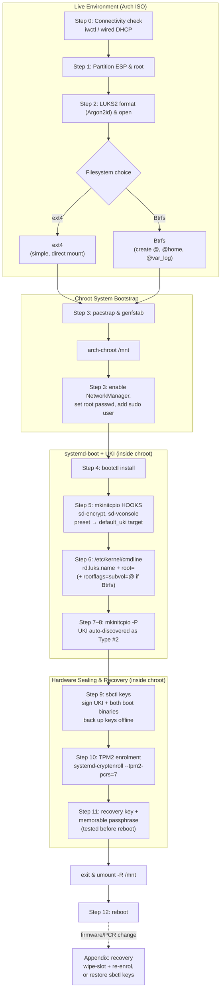

# Arch Linux: systemd-boot + LUKS2 + TPM2 + Secure Boot

A guide for setting up Arch Linux with full disk encryption, TPM2 auto-unlock,
and Secure Boot — using `systemd-boot` and Unified Kernel Images instead of
GRUB. This avoids GRUB's Argon2id/PBKDF2 compatibility questions and the
still-unmerged GRUB LUKS2 `systemd-tpm2` token bridge, since `systemd-boot`
never touches LUKS at all — disk decryption happens entirely in the
initramfs via `sd-encrypt`.

**Scope:** this guide covers the boot/encryption chain specifically — it is
not a full Arch installation walkthrough. It assumes you'll handle most of
the usual remaining install steps (locale, hostname) separately, per the
standard Arch installation guide. Network manager installation and basic
user setup are the two exceptions — see the notes in step 3, since
skipping either leaves you with a system you effectively can't use or
update after the first reboot.

**One networking gotcha worth knowing before you start:** unlike most of
the deferred post-install tasks, missing network config isn't just an
inconvenience — after the first reboot you'll have a `base` system with no
network manager installed at all, meaning you can't even run `pacman -Syu`
to catch up on anything else without first getting online. `linux-firmware`
(already in step 3's `pacstrap`) covers Wi-Fi firmware and the kernel's
`iwlwifi` driver will load, so the hardware itself will be detected — but
nothing will automatically connect. Step 3 below includes `networkmanager`
in `pacstrap` and enables it in the chroot for exactly this reason; if
you'd rather handle networking differently, that's the point in the guide
to change it.

---

## Architecture overview



This mirrors the numbered steps below — the diagram is an overview, not a
replacement for reading the actual commands in each section, particularly
around the filesystem branch in step 2 and the cmdline branch in step 6.

---

## 0. Connect to the internet (live ISO)

Everything from here through `pacstrap` needs network access from the
live environment itself — this is separate from `networkmanager`, which
gets installed onto the *new* system for use after reboot, not for the
install process.

**Wired:** usually just works via DHCP automatically. Confirm with:

```bash
ping -c3 archlinux.org
```

**Wi-Fi:** the live ISO ships `iwd` already, accessible via `iwctl`:

```bash
iwctl
```

Inside the `iwctl` prompt:

```
device list
station wlan0 scan
station wlan0 get-networks
station wlan0 connect "Your-SSID"
```

(substitute your actual device name if it's not `wlan0`, and your
network's SSID). Enter your Wi-Fi password when prompted, then exit:

```
exit
```

Confirm connectivity:

```bash
ping -c3 archlinux.org
```

### Optional: SSH in from another machine

Once you're online, the rest of the install can be done over SSH from a
different computer rather than typing everything at the laptop's own
keyboard — genuinely worth it for a long, multi-step install like this
one, since copy-pasting commands from this guide is much easier on a full
keyboard/screen elsewhere than on the install target itself.

Set a root password on the live environment (this is separate from, and
unrelated to, the root password you'll set on the actual installed system
in step 3):

```bash
passwd
```

Start SSH on the live ISO — it's already installed, just not running by
default:

```bash
systemctl start sshd
```

Find this machine's IP address:

```bash
ip addr
```

Look for the address on your active interface (`wlan0` for Wi-Fi, or the
Ethernet interface name if wired) — typically something like
`192.168.x.x`.

From another machine on the same network:

```bash
ssh root@<the-IP-you-found>
```

Accept the host key prompt on first connection, enter the password you
just set, and you're in — everything from partitioning onward can now be
run from this SSH session instead of the laptop's own console. This is a
convenience for the live-ISO stage only; it has no bearing on the
installed system's own SSH configuration, which isn't covered by this
guide.

Don't proceed to partitioning until the network connectivity check above
succeeds — `pacstrap`, `genfstab`, and everything else through step 3
depends on it. The SSH step above is optional; skip straight to step 1 if
you'd rather work directly at the laptop's console.

## 1. Partitioning (during install)

- **EFI System Partition** — FAT32, ~512MB, mounted at `/efi`
  (systemd-boot convention; not `/boot/efi`)
- **Root** — one LUKS2 partition, containing Btrfs or ext4

If you're dual-booting and already have an ESP from an existing Windows
or other Linux install, you don't need a fresh one — reuse it. Confirm
its partition type is `EFI System`
(`C12A7328-F81F-11D2-BA4B-00A0C93EC93B` in GPT, shown by tools like
`fdisk`/`gdisk` as type `ef00`), and mount the existing partition at
`/efi` rather than creating a new one. Arch's UKI and `systemd-boot`
files coexist fine alongside an existing OS's boot files on the same ESP
— nothing in this guide touches or removes what's already there.

## 2. Encrypt and open the root partition

```bash
cryptsetup luksFormat --type luks2 --pbkdf argon2id \
  --pbkdf-memory 8388608 /dev/sdXY
cryptsetup open /dev/sdXY cryptroot
```

`--pbkdf-memory 8388608` sets the Argon2id memory cost to 8GiB, well above
`cryptsetup`'s 1GiB default and RFC 9106's 2GiB "default for all
environments" recommendation. This is a deliberate choice here, not a
generally-recommended value — it makes sense specifically because this
machine has 40GB of RAM to spare and this drive isn't intended to move to
lower-RAM hardware. On a machine with less memory headroom, or a drive
that might get unlocked elsewhere, RFC 9106's 2GiB figure
(`--pbkdf-memory 2097152`) is the better-grounded default. Test the unlock
time once after formatting:

```bash
time cryptsetup open /dev/sdXY cryptroot
```

Argon2id works natively here — no PBKDF2 workaround needed, since nothing
in this chain touches GRUB. `--iter-time` is also tunable if you want to
adjust the time cost independently, though the memory cost above is doing
most of the real hardening work. Note that defaults and available flags
do shift between `cryptsetup` versions.

### Filesystem choice: ext4 or Btrfs

Both work fine with this boot chain — `sd-encrypt` and `systemd-boot`
don't care which one sits inside the LUKS volume. The tradeoff is between
simplicity and rollback capability, not compatibility.

**ext4** — simpler, zero maintenance, predictable free-space reporting.
Good default if you don't specifically want snapshots.

```bash
mkfs.ext4 /dev/mapper/cryptroot
mount /dev/mapper/cryptroot /mnt
mkdir -p /mnt/efi
mount /dev/sdXZ /mnt/efi   # your ESP partition
```

**Btrfs** — worth it mainly for snapshots: on a rolling-release distro
like Arch, being able to snapshot before `pacman -Syu` (or before
re-signing UKIs via `sbctl`) and roll back a broken update in seconds is a
genuine safety net this guide's threat model doesn't otherwise cover.
Trade-off is a bit more maintenance (periodic scrub/balance) and slightly
less predictable `df` output due to copy-on-write allocation. This guide
uses Btrfs without compression — `compress=zstd` is a reasonable addition
later if you want it, but it's a separate decision from the subvolume
layout below, so it's left out here to keep the filesystem setup and the
compression choice independent.

```bash
mkfs.btrfs /dev/mapper/cryptroot
mount /dev/mapper/cryptroot /mnt

btrfs subvolume create /mnt/@
btrfs subvolume create /mnt/@home
btrfs subvolume create /mnt/@var_log
btrfs subvolume create /mnt/@swap
umount /mnt

mount -o noatime,subvol=@ /dev/mapper/cryptroot /mnt
mkdir -p /mnt/{efi,home,var/log,swap}
mount -o noatime,subvol=@home /dev/mapper/cryptroot /mnt/home
mount -o noatime,subvol=@var_log /dev/mapper/cryptroot /mnt/var/log
mount -o noatime,subvol=@swap /dev/mapper/cryptroot /mnt/swap
mount /dev/sdXZ /mnt/efi   # your ESP partition
```

`@swap` is created here alongside the others regardless of whether you
actually end up using a swapfile — it costs nothing to have an empty
subvolume, and creating it now (as a proper sibling of `@`, while `/mnt`
is still mounted at the top level) avoids a more awkward remount dance
later if you try to create it after switching to `subvol=@`.

`@var_log` as its own subvolume means logs survive if you ever roll `@`
back to an earlier snapshot — otherwise a rollback would silently revert
your logs along with everything else, which defeats half the point of
having them. If you go this route, `snapper` (or a similar tool) for
managing the actual snapshot lifecycle is the natural next step, but it's
outside this guide's scope — the subvolume layout above just lays the
groundwork for it.

The rest of this guide assumes root is mounted at `/mnt` and the ESP at
`/mnt/efi` regardless of which filesystem you picked — the remaining steps
don't otherwise differ between ext4 and Btrfs.

### Swap: a swapfile instead of a separate partition

A swapfile inside your already-encrypted root is simpler than a separate
swap partition — it's encrypted automatically as part of the LUKS volume,
with no second `cryptsetup` entry and no extra unlock prompt, and no
disk space locked into a fixed-size partition ahead of time. This also
means you don't need a third partition on the disk at all — just the ESP
and one LUKS2 partition for everything else.

**ext4:**

```bash
fallocate -l 8G /mnt/swapfile
chmod 600 /mnt/swapfile
mkswap /mnt/swapfile
swapon /mnt/swapfile
```

**Btrfs** — the `@swap` subvolume was already created and mounted at
`/mnt/swap` in the block above (regardless of whether you use it — no
harm if it stays empty). `btrfs filesystem mkswapfile` handles the
copy-on-write exclusion, permissions, and preallocation in one step —
manually chaining `truncate`/`chattr +C`/`fallocate`/`chmod`/`mkswap` is
the older way and no longer necessary since btrfs-progs 6.1:

```bash
btrfs filesystem mkswapfile --size 8G /mnt/swap/swapfile
swapon /mnt/swap/swapfile
```

Adjust the `8G` size to whatever suits your RAM and whether you want
hibernation support (see below).

`genfstab` will pick up the swapfile automatically **only if it already
exists before you run `genfstab` in step 3**. If you create the swapfile
after that point instead, add the line to `/etc/fstab` by hand:

```
/swapfile none swap defaults 0 0
```

(adjust the path to `/swap/swapfile` if you used the Btrfs layout above).

**Hibernation:** if you want to hibernate, it has to go through the
swapfile, not `zram` — hibernating to zram swap isn't supported, even
with a backing device configured. A swapfile-based hibernate needs a
`resume=` kernel parameter pointing at the swapfile's physical offset,
which is genuinely more involved to set up correctly with a swapfile
than with a dedicated swap partition — outside this guide's scope. If
hibernation matters to you, it's worth deciding that before committing to
the swapfile approach, since a plain swap partition is the simpler path
for that specific use case.

A swapfile and `zram` aren't mutually exclusive — `zram`'s compressed
in-RAM swap is used first by default (**higher** priority number wins,
not lower), with the disk-backed swapfile as overflow if RAM pressure
exceeds what `zram` can absorb. Setup for `zram` is in step 3, since it's
installed via `pacstrap` and configured inside the chroot.

## 3. Install the base system as normal, then chroot in

```bash
pacstrap /mnt base base-devel linux linux-headers linux-firmware mkinitcpio \
  sbctl btrfs-progs efibootmgr dosfstools intel-ucode networkmanager sudo \
  zram-generator \
  mc nano vim htop wget iwd iotop-c less man-pages mandoc bc
```

`sudo` isn't part of `base` — it's included here because the `wheel`/
`visudo` step further down in this section needs it installed already.
Without it, `visudo` won't exist to run.

`base-devel` and `linux-headers` are worth adding even though this guide
doesn't itself compile anything: `base-devel` (compilers, `make`, and the
rest of the standard build toolchain) is required the moment you install
anything from the AUR, and `linux-headers` is required for any
out-of-tree kernel module (DKMS-based drivers, VirtualBox host modules,
etc.). Neither is needed for the boot chain itself, but going without
them tends to mean an extra `pacman -S` and possibly a reboot the first
time you actually need either — cheaper to include now.

The rest of that line is general-purpose tooling, not required by
the boot/encryption chain, but worth having from first boot rather than
needing network access (which won't exist yet if something's wrong) to
fetch later:

- `nano`, `vim`, `mc` — text editors and a file manager; `mc` in
  particular is handy for poking around a fresh system
- `htop`, `iotop-c` — process and disk I/O monitoring
- `less`, `man-pages`, `mandoc` — so `man` pages actually work; `base`
  alone doesn't include documentation
- `wget` — command-line downloads
- `iwd` — an alternative Wi-Fi backend to `wpa_supplicant`; `NetworkManager`
  can use either, and `iwd` also works standalone via `iwctl` if you ever
  need to debug connectivity without NetworkManager in the picture
- `bc` — basic command-line arithmetic, occasionally useful in scripts

`networkmanager` is included here on the assumption you're on Wi-Fi (as on
a laptop like the XPS) — drop it if you're wired and happy configuring
`systemd-networkd` yourself instead. Enable it once you're in the chroot,
further down in this step.

`efibootmgr` and `dosfstools` aren't strictly required by this chain, but
you'll want both available for troubleshooting boot entries and working
with the FAT-formatted ESP from a running system.

`btrfs-progs` is worth having in the initramfs — not for `fsck` (Btrfs
doesn't use a boot-time fsck pass; `fsck.btrfs` is intentionally a no-op,
since Btrfs does its consistency checking in-kernel at mount time), but
for `btrfs device scan` if you ever use a multi-device Btrfs array, and
for `btrfs check`/repair tools being available in an emergency initramfs
shell. (Skip this package if you formatted root as ext4 instead, where
`fsck` genuinely does matter and the `fsck` hook below is doing real work.)

Generate `/etc/fstab` **before** chrooting, so the ESP and any non-root
mounts are correctly wired up:

```bash
genfstab -U /mnt >> /mnt/etc/fstab
```

Root itself is located via the `rd.luks.name=` and `root=` kernel
parameters set in step 6, not via fstab — but the ESP mount and anything
else still needs a correct fstab entry, and skipping this step is a
common cause of a system dropping to an emergency shell on first boot.

Now chroot in:

```bash
arch-chroot /mnt
```

If you included `networkmanager` above, enable it now while you're
already here:

```bash
systemctl enable NetworkManager
```

### zram

`zram-generator` doesn't need a `systemctl enable` — it's a systemd
generator, meaning it creates the swap unit automatically at boot based
on a config file, rather than being a service you enable directly.
Create that config now:

```bash
cat > /etc/systemd/zram-generator.conf << 'EOF'
[zram0]
zram-size = min(ram / 2, 8192)
# 8192 here means 8192 MB (~8GiB) — bare numbers in this config are
# megabytes by definition, not bytes; this matches zram-generator's own
# documented default of min(ram / 2, 4096)
compression-algorithm = zstd
swap-priority = 100
fs-type = swap
EOF
```

`zram-size = min(ram / 2, 8192)` sizes the compressed swap device at half
your RAM, capped at 8GiB — reasonable defaults; adjust to taste. If you'd
rather not deal with the `min()` expression at all, a plain fixed size
works too — `zram-size = 8192` gives a flat 8GiB regardless of how much
RAM the machine has, no expression needed.
`swap-priority = 100` ensures `zram` is preferred over the disk-backed
swapfile from step 2, which should have a lower priority set in its
`fstab` entry (or none, which defaults lower) so `zram` gets used first
and the swapfile only kicks in as overflow. No further action needed here
— the generator picks this config up automatically on next boot.

### Root password and a sudo-capable user

The base install has no usable login yet — set the root password and
create a normal user while you're still in the chroot, rather than
discovering there's no way in after the first reboot:

```bash
passwd
```

That sets root's password (running `passwd` with no username, while
still root inside the chroot, targets root itself).

```bash
useradd -m -G wheel -s /bin/bash george
passwd george
```

Adjust the username as you like. `-m` creates a home directory, `-G wheel`
adds the user to the `wheel` group, `-s /bin/bash` sets the shell.

Being in `wheel` isn't enough on its own — Arch ships `sudo` but doesn't
enable the `wheel` group for it by default. Edit the sudoers file with
`visudo`, never a direct text editor, since it validates syntax before
saving and a broken sudoers file can lock you out of `sudo` entirely:

```bash
EDITOR=nano visudo
```

Find and uncomment this line:

```
%wheel ALL=(ALL:ALL) ALL
```

Save and exit. Your user can now `sudo` after the next login.

## 4. Install and enable systemd-boot

```bash
bootctl install
```

This installs directly to the ESP — no `grub-mkconfig`, no `grub.cfg`
scripting.

## 5. Build a Unified Kernel Image (UKI)

Arch's `mkinitcpio` can output UKIs natively, but the two config files
involved do different jobs: `/etc/mkinitcpio.conf` sets which **hooks**
run, while `/etc/mkinitcpio.d/linux.preset` sets the **output target** —
including whether a UKI gets built at all.

In `/etc/mkinitcpio.conf`, use the `sd-encrypt` hook (not the legacy
`encrypt` hook). Note that `sd-vconsole` supersedes the older `keyboard`
hook when using the `systemd` hook stack, so it's dropped here:

```
HOOKS=(base systemd autodetect microcode modconf kms sd-vconsole block sd-encrypt filesystems fsck)
```

If your root is Btrfs, the `fsck` hook here is harmless but does nothing —
Btrfs has no boot-time fsck pass, so this hook is only doing real work on
ext4. Feel free to drop it from `HOOKS` on a pure-Btrfs setup; leaving it
in costs nothing either way.

`sd-vconsole` reads `/etc/vconsole.conf` for your keymap and console font.
If you're on a non-US keyboard layout, set this now — otherwise your LUKS
passphrase prompt (and everything else pre-userspace) will default to a US
layout:

```bash
echo "KEYMAP=uk" > /etc/vconsole.conf   # adjust to your layout
```

Then edit your kernel's preset file to point output at a UKI on the ESP
instead of a standard `.img`. The filename matches your kernel package —
`linux.preset` for the standard kernel, `linux-lts.preset` for LTS, and so
on. Check what you actually have:

```bash
ls /etc/mkinitcpio.d/
```

Then edit the relevant preset (`/etc/mkinitcpio.d/linux.preset` in the
standard case) with a text editor, e.g.:

```bash
nano /etc/mkinitcpio.d/linux.preset
```

You're looking for two existing lines and replacing each with a `_uki`
equivalent — nothing here needs to be invented, just found and edited.

**Before** (what's already in the file):
```sh
default_image="/boot/initramfs-linux.img"
fallback_image="/boot/initramfs-linux-fallback.img"
```

**After** (comment out the old lines, add the new ones directly below):
```sh
# default_image="/boot/initramfs-linux.img"
default_uki="/efi/EFI/Linux/arch-linux.efi"

# fallback_image="/boot/initramfs-linux-fallback.img"
fallback_uki="/efi/EFI/Linux/arch-linux-fallback.efi"
```

If your preset has no `fallback_image` line at all, skip the fallback
half — not every install uses one.

`mkinitcpio` will not create the destination directory for you — if
`/efi/EFI/Linux/` doesn't exist yet, UKI generation fails silently. Create
it before your first build:

```bash
mkdir -p /efi/EFI/Linux
```

### CPU microcode

With a traditional (non-UKI) setup, microcode is usually loaded via a
separate `initrd` directive the bootloader concatenates in. With a UKI,
there's no separate step — `mkinitcpio` bundles microcode directly into
the unified `.efi` binary automatically, provided the relevant package
(`amd-ucode` or `intel-ucode`, per step 3) is already installed before you
run `mkinitcpio -P` in step 7. No further action needed here — this is
just confirming why step 3 included it up front rather than leaving it as
an afterthought.

## 6. Kernel command line for sd-encrypt

Create `/etc/kernel/cmdline`. **This differs depending on which filesystem
you picked in step 2** — if you're on Btrfs with the subvolume layout
above, the kernel needs to be told which subvolume is root, or it'll mount
the top-level volume (which contains nothing but the `@`/`@home`/
`@var_log` directories) instead of your actual system, landing you in an
emergency shell.

**ext4:**
```
rd.luks.name=<LUKS-UUID>=cryptroot root=/dev/mapper/cryptroot rw
```

**Btrfs (with the `@` subvolume layout above):**
```
rd.luks.name=<LUKS-UUID>=cryptroot root=/dev/mapper/cryptroot rw rootflags=subvol=@
```

Use whichever line matches your step 2 choice — don't use the Btrfs line
on an ext4 install. An unrecognised mount option isn't reliably ignored by
every filesystem driver; treat the two as genuinely different commands
rather than one that happens to work for both.

Replace `<LUKS-UUID>` with the output of:

```bash
blkid -s UUID -o value /dev/sdXY
```

`mkinitcpio` reads `/etc/kernel/cmdline` when building a UKI and embeds it
into the `.efi` binary — that embedding is what makes the command line
tamper-evident under Secure Boot, since altering it breaks the signature.
If your preset overrides this with its own `CMDLINE=` or similar, that
takes precedence, so check the preset if the parameters don't appear to
take effect. If you run multiple kernels (e.g. `linux` and `linux-lts`),
each has its own preset and each needs its UKI target configured.

## 7. Rebuild the UKI

```bash
mkinitcpio -P
```

## 8. Boot entry auto-discovery

Unlike GRUB2-BLS or manually-placed `.conf` entries, a UKI placed directly
in `/efi/EFI/Linux/` is auto-discovered by `systemd-boot` as a **Type #2**
entry — no manual boot entry file is needed.

Just confirm `/efi/loader/loader.conf` exists:

```bash
cat /efi/loader/loader.conf
```

A minimal version is fine:

```
default @saved
timeout 3
console-mode max
```

`systemd-boot` will populate the boot menu dynamically from
`/efi/EFI/Linux/*.efi`.

## 9. Secure Boot — enrol your own keys

Arch has no vendor shim in Microsoft's trust chain (unlike Fedora), so this
step is mandatory, not optional, if you want Secure Boot at all.

```bash
sbctl status          # confirm you're in Setup Mode
sbctl create-keys
sbctl enroll-keys -m  # -m includes Microsoft's certs — useful for dual-boot
                       # and firmware update compatibility
sbctl sign -s /efi/EFI/Linux/arch-linux.efi
sbctl sign -s /efi/EFI/BOOT/BOOTX64.EFI
sbctl sign -s /efi/EFI/systemd/systemd-bootx64.efi
```

The `-m` flag isn't just for dual-boot — some hardware needs it regardless.
Certain option ROMs (some Nvidia GPUs, some OEM storage controllers) are
themselves signed under Microsoft's Third-Party UEFI CA, not by you. On a
purely single-boot Arch system with such hardware, omitting `-m` can mean
a black screen or storage controller failure at boot, since the firmware
would refuse to run that unsigned-by-your-keys component before Linux even
starts. Keep `-m` unless you have a specific reason not to.

Sign all three, not just the first two. `/efi/EFI/BOOT/BOOTX64.EFI` is
typically a fallback copy — the file `bootctl update` actually refreshes
when `systemd` itself is updated is `/efi/EFI/systemd/systemd-bootx64.efi`.
Skipping it means your primary boot binary can end up unsigned after a
routine system update.

The `-s` flag registers the file so `sbctl` auto-resigns it via a pacman
hook on future kernel/UKI rebuilds — you shouldn't need to re-run `sbctl
sign` manually after routine updates.

### Back up your Secure Boot keys

`sbctl` stores its generated keys under `/usr/share/secureboot/` (older
versions used `/var/lib/sbctl/` — check `sbctl status` for the actual
path). Back these up to offline storage now:

```bash
sbctl status                    # confirm key location and enrolment state
```

Then copy the directory it reports to external media — don't hardcode the
path, since it varies by version:

```bash
# Example, if sbctl status reports /usr/share/secureboot:
cp -a /usr/share/secureboot /root/sbctl-keys-backup
# then move /root/sbctl-keys-backup to offline storage
```

Verify the backup is readable from another machine before you rely on it —
an unverified backup of key material is worth roughly nothing.

This matters because of the firmware-reset scenario described in step 10:
if a major UEFI update wipes your enrolled keys, having the originals
means re-enrolling them rather than regenerating everything and re-signing
from scratch. Treat them like any other private key material — offline,
not on the encrypted disk they protect.

### Verify the auto-signing hook actually works

Don't assume the pacman hook fires — test it once now, while you can still
fix it easily:

```bash
mkinitcpio -P     # rebuild the UKI
sbctl verify      # confirm the freshly rebuilt UKI is signed
```

If `sbctl verify` reports the new UKI as unsigned, the hook didn't run, and
your next kernel update will silently leave you with an unbootable
Secure Boot system. Check `/usr/share/libalpm/hooks/` for sbctl's hook and
confirm you used `sbctl sign -s` (with the `-s`) rather than plain
`sbctl sign`.

## 10. TPM2 enrolment

```bash
systemd-cryptenroll --tpm2-device=auto --tpm2-pcrs=7 /dev/sdXY
```

Note the device argument is the **LUKS container partition** (`/dev/sdXY`,
the same one you ran `luksFormat` against), not the opened mapper device
(`/dev/mapper/cryptroot`). Enrolment writes a token into the LUKS2 header,
which lives on the container.

This is the same command regardless of distro or bootloader — `sd-encrypt`
in the initramfs reads the `systemd-tpm2` LUKS2 token natively. No GRUB-side
bridging, no manual key sealing.

### PCR selection — what you're actually choosing

| PCRs | Protects against | Tradeoff |
|---|---|---|
| `7` only | Secure Boot chain tampering | Survives most firmware/UEFI updates without re-enrolment |
| `0+7` | + low-level firmware settings | More brittle — breaks on more firmware updates |
| `0+2+7` | + option ROM tampering | Most brittle — highest chance of unexpected lockout |

Start with `--tpm2-pcrs=7`. Only add more PCRs if you specifically need to
detect the additional tampering vectors, and only after you understand
you'll be re-enrolling more often.

> **Caution:** a routine firmware update changing PCR 7's value is
> recoverable — re-enrol and move on. A *major* UEFI/firmware update that
> resets the Secure Boot key database to factory defaults is a different,
> more serious failure: it wipes your custom-enrolled `sbctl` keys
> entirely, and no LUKS recovery key will fix that, since the problem is
> the boot chain no longer trusting your signed binaries at all. This is
> a real, if uncommon, risk inherent to self-signed Secure Boot setups —
> not something this guide (or any guide) can fully protect against.
> Check release notes before applying major firmware updates, and keep a
> record of your `sbctl` key material backed up separately.

## 11. Add a recovery key (do this before you reboot)

TPM2/PCR-bound unlocking **can and does break** — most commonly after a
routine firmware update changes a bound PCR's value. Without a fallback,
this means a full reinstall. Generate one now:

```bash
systemd-cryptenroll --recovery-key /dev/sdXY
```

This prints a high-entropy recovery passphrase. **Write it down or save it
somewhere off this machine** — a locked-out disk with no recovery key and
no other working slot is not recoverable.

### Add a memorable passphrase too

The recovery key is long and random by design — useful, but not something
you'll have memorised or necessarily have on you. A third slot with a
passphrase you can actually type is worth having:

```bash
cryptsetup luksAddKey /dev/sdXY
```

You now have three independent unlock paths: TPM2 (automatic), the
recovery key (offline, high-entropy), and a passphrase (memorable). Losing
any one of them isn't fatal.

### Test the fallbacks before you rely on them

Confirm each slot actually works before you trust the setup — `--test-passphrase`
verifies a slot without opening the device:

```bash
cryptsetup open --test-passphrase /dev/sdXY   # try the recovery key
cryptsetup open --test-passphrase /dev/sdXY   # try the passphrase
```

A silent exit (return code 0) means the slot matched. Doing this now is
considerably cheaper than discovering a typo in your saved recovery key
after a firmware update has already locked you out.

## 12. Finish and reboot

```bash
exit
umount -R /mnt
reboot
```

Remove the install media and confirm the system boots, unlocks
automatically via TPM2, and Secure Boot shows as enabled
(`bootctl status` should confirm this once booted).

---

## What this avoids, compared to a GRUB-based setup

- No Argon2id vs. PBKDF2 compatibility question — `sd-encrypt` never had
  the limitation GRUB's `cryptomount` did
- No GRUB SRK/NV-index key-sealing dance
- No dependency on GRUB's unmerged LUKS2 `systemd-tpm2` token bridge
  (submitted by Yann Diorcet, still unlanded as of this writing)
- UKI is the native model here, not a retrofit

## What you give up

- No legacy BIOS boot fallback (UEFI only)
- No GRUB-level exotic filesystem/RAID/LVM traversal — anything below the
  UKI is the kernel's problem, not the bootloader's (irrelevant for a
  single LUKS2 partition like this one)
- PCR brittleness is still a real, live risk — this is an `sd-encrypt` /
  `systemd-cryptenroll` characteristic, not something either bootloader
  fixes. The recovery key in step 11 is not optional in practice.

---

## Appendix: install checklist

A condensed version of the above, for working through at the terminal.

- [ ] Connected to the internet from the **live ISO** (`iwctl` for Wi-Fi,
      or wired DHCP), confirmed with `ping archlinux.org`
- [ ] (Optional) `passwd` + `systemctl start sshd` on the live ISO,
      SSH'd in from another machine for the rest of the install
- [ ] ESP formatted FAT32, root partition LUKS2 with `--pbkdf argon2id`
- [ ] Root mounted at `/mnt`, ESP mounted at `/mnt/efi`
- [ ] (Optional) swapfile created before `genfstab` so it's picked up
      automatically — `btrfs filesystem mkswapfile` in the pre-created
      `@swap` subvolume if Btrfs, `fallocate`+`mkswap` if ext4
- [ ] `pacstrap` includes microcode (`amd-ucode`/`intel-ucode`), `sbctl`,
      `btrfs-progs` (if Btrfs), `efibootmgr`, `dosfstools`, `networkmanager`,
      `sudo`, `base-devel`, `linux-headers`, `zram-generator`, plus general
      tooling (editors, `htop`, `man-pages`, etc.)
- [ ] `genfstab -U /mnt >> /mnt/etc/fstab` run **before** `arch-chroot`
- [ ] `systemctl enable NetworkManager` run inside the chroot
- [ ] `/etc/systemd/zram-generator.conf` created (no `systemctl enable`
      needed — it's a generator, picked up automatically at boot)
- [ ] root password set (`passwd`) and a sudo-capable user created
      (`useradd -m -G wheel -s /bin/bash <name>`, then `passwd <name>`)
- [ ] `%wheel ALL=(ALL:ALL) ALL` uncommented via `visudo` (never edited
      directly)
- [ ] `bootctl install`
- [ ] `HOOKS` has `systemd`, `block`, `sd-encrypt` in that order;
      `sd-vconsole` present, `keyboard` removed
- [ ] `/etc/vconsole.conf` set if not on a US keyboard layout
- [ ] Correct `/etc/mkinitcpio.d/*.preset` edited: `default_uki` set,
      `default_image` commented out
- [ ] `mkdir -p /efi/EFI/Linux` before first build
- [ ] `/etc/kernel/cmdline` contains
      `rd.luks.name=<UUID>=cryptroot root=/dev/mapper/cryptroot rw` —
      **plus `rootflags=subvol=@` if you're on Btrfs**
- [ ] `mkinitcpio -P` run; UKI confirmed present in `/efi/EFI/Linux/`
- [ ] `/efi/loader/loader.conf` exists
- [ ] `sbctl create-keys`, `sbctl enroll-keys -m`
- [ ] `sbctl sign -s` run on all three: the UKI, `BOOTX64.EFI`, and
      `systemd-bootx64.efi`
- [ ] sbctl keys copied to offline media, and backup verified readable
      elsewhere
- [ ] Auto-signing hook tested: `mkinitcpio -P` then `sbctl verify`
- [ ] `systemd-cryptenroll --tpm2-device=auto --tpm2-pcrs=7 /dev/sdXY`
      (LUKS container, not the mapper device)
- [ ] `systemd-cryptenroll --recovery-key /dev/sdXY`; recovery key stored
      offline
- [ ] `cryptsetup luksAddKey /dev/sdXY` for a memorable passphrase
- [ ] Both fallbacks tested with `cryptsetup open --test-passphrase`
      **before** rebooting
- [ ] Remaining post-install tasks done (locale, hostname)

---

## Appendix: recovery after a firmware change

Two distinct failure modes, with different fixes. Work out which one you're
in before doing anything.

### Symptom: TPM2 auto-unlock stopped, but you get a passphrase prompt

A bound PCR changed — most commonly PCR 7 after a firmware update. The
boot chain is intact; only the TPM binding is stale.

Unlock with your recovery key or passphrase, boot normally, then re-enrol:

```bash
systemd-cryptenroll --wipe-slot=tpm2 /dev/sdXY
systemd-cryptenroll --tpm2-device=auto --tpm2-pcrs=7 /dev/sdXY
```

`--wipe-slot=tpm2` removes the stale TPM keyslot specifically, leaving
your recovery key and passphrase slots untouched. Confirm with
`cryptsetup luksDump /dev/sdXY` that you still have the other slots before
and after.

### Symptom: firmware refuses to boot your UKI at all

The Secure Boot key database was reset to factory defaults — your enrolled
keys are gone, so the firmware no longer trusts anything you signed. A LUKS
recovery key doesn't help here; the disk isn't the problem.

1. Disable Secure Boot in firmware setup to get booting again, or boot
   from Arch install media and chroot in.
2. Restore your backed-up sbctl keys to the path `sbctl status` reports,
   or — if the backup is lost — `sbctl create-keys` to generate new ones.
3. Put the firmware back into Setup Mode, then:

```bash
sbctl enroll-keys -m
sbctl sign -s /efi/EFI/Linux/arch-linux.efi
sbctl sign -s /efi/EFI/BOOT/BOOTX64.EFI
sbctl sign -s /efi/EFI/systemd/systemd-bootx64.efi
sbctl verify
```

4. Enable Secure Boot and reboot.

If you generated *new* keys rather than restoring the originals, PCR 7 has
changed as a result — so you'll also need the TPM re-enrolment from the
first case above.
